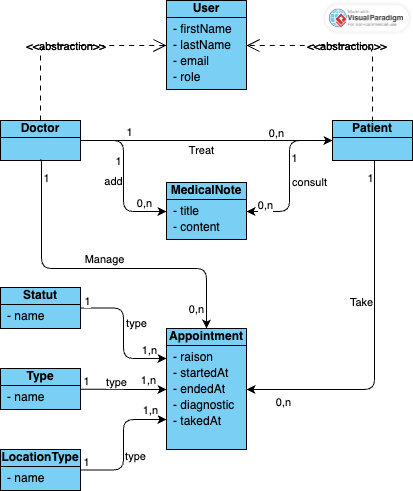

# 🏥 E-care

## 📖 Description
E-care is a healthcare management platform similar to **Doctolib**. This project is part of a coursework assignment and aims to provide features such as:
- ✅ User registration and authentication
- 📅 Booking and managing medical appointments
- 🩺 Accessing and updating medical records by doctors

## 🚀 Technologies Used
The project is built using the following technologies:
- 🏗️ **Next.js** – Frontend framework
- 🎨 **Tailwind CSS** – Styling
- 🖥️ **ShadCN** – UI components
- 🗄️ **Prisma** – ORM for database interactions
- 🔥 **Supabase** – Backend as a service
- 🧪 **Jest** – Testing framework

## ⚙️ Installation
No additional prerequisites are required.

1. Clone the repository:
   ```sh
   git clone https://github.com/imxale/e-care
   cd e-care
   ```
2. Install dependencies:
   ```sh
   npm install
   ```
3. Run the development server:
   ```sh
   npm run dev
   ```

## 🔧 Configuration
Create a `.env` file in the project root and add the following environment variables:
```env
SUPABASE_URL=<your-supabase-url>
SUPABASE_ANON_KEY=<your-supabase-anon-key>
DATABASE_URL=<your-database-url>
```

## 🎯 Usage
E-care provides the following core functionalities:
- 👤 **User Authentication**: Sign up and log in to the platform
- 📅 **Appointment Booking**: Patients can schedule appointments with doctors
- 📄 **Medical Records**: Doctors can update patient medical records
- 📊 **Dashboard**: Both users & doctor have a dashboard to manage appointments

More details will be added later.

## 🧪 Testing
Run the test suite with:
```sh
npm run test
```
Lint the code with:
```sh
npm run lint
```

## 🚀 Deployment
The project is deployed on **Vercel** using the `main` branch.

## ⚡ GitHub Actions
A GitHub Action is set up to run tests and linting on both `develop` and `main` branches.

## 👥 Contributors
- 🛠️ Yoann Chambeux - [GitHub Profile](https://github.com/Yoann-CH)
- 🔍 Kevin Guest - [GitHub Profile](https://github.com/k-guest)
- 💡 Kieran Huon - [GitHub Profile](https://github.com/Kieran-Huon)
- 🚀 Axel Blanchard -[GitHub Profile](https://github.com/imxale)

## 📝 UML


